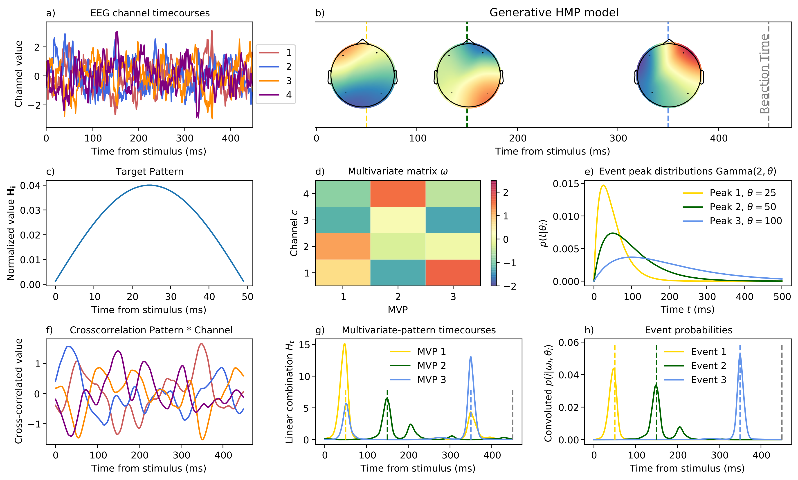

# Repository for the paper on Hidden Multivariate pattern (HMP)

**Title: Trial-by-trial detection of cognitive events in neural time-series**

**Authors : Gabriel Weindel, Leendert van Maanen, Jelmer P. Borst**


This repository contains all the data and code to reproduce the analysis and figures presented in the paper.

- Folder plots/ contains the figure of the method and eventual plots produced wuth the scripts in results/
- Folder results/simulations contains the data and code to reproduce the section "Simulations"
- Folder results/replication contains the data and code to reproduce the section "Application to real data"

In order to reproduce the analysis and figures the easiest way is to install a specific conda environment as follows:

```bash
conda create -n hmp pymc arviz xarray pandas mne bambi seaborn
conda activate hmp
conda install pip #if not already installed
pip install hmp==0.4.0
```
